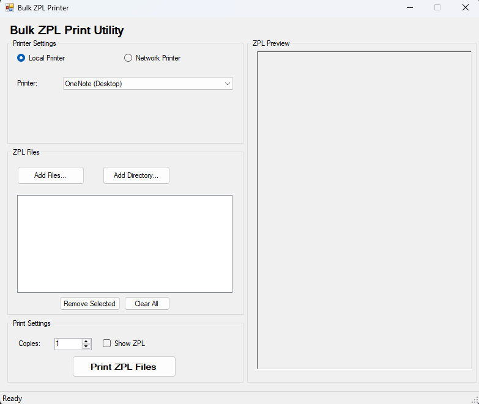

# Bulk ZPL Printer

A Windows desktop application for sending bulk ZPL (Zebra Programming Language) printing jobs to label printers.

## Features

- **Multiple Printer Support**
  - Print to local printers using Windows drivers
  - Direct network printing via TCP/IP (port 9100)

- **ZPL File Management**
  - Add individual ZPL files or entire directories
  - Preview ZPL code before printing
  - Visual label preview using Labelary API
  - Remove selected files or clear all files

- **Print Options**
  - Print multiple copies of each file
  - Track print progress with status updates
  - Comprehensive error handling and reporting

- **Raw Printing**
  - Uses Windows API for direct raw printing
  - Properly handles ZPL commands without translation or interpretation
  - Maintains correct formatting of ZPL code for accurate label printing

## Screenshots



## Requirements

- Windows OS
- .NET Framework 4.5 or higher
- Compatible Zebra or ZPL-capable printer

## Installation

1. Download the latest release from the [Releases](https://github.com/yourusername/bulk-zpl-printer/releases) page
2. Extract the ZIP file to a location of your choice
3. Run `BulkZPLPrinter.exe`

No installation required - the application is portable.

## Usage

### Connecting to a Printer

#### Local Printer
1. Select "Local Printer" option
2. Choose your printer from the dropdown list

#### Network Printer
1. Select "Network Printer" option
2. Enter the IP address of your printer
3. Specify the port (default: 9100)

### Adding ZPL Files

1. Click "Add Files..." to select individual ZPL files
2. Or click "Add Directory..." to add all ZPL files from a folder
3. Added files will appear in the list

### Previewing ZPL

1. Check "Show ZPL" to view the ZPL code
2. Check "Show Image" to see a visual preview of how the label will print
3. Select a file from the list to preview its content

### Printing

1. Set the number of copies to print
2. Click "Print ZPL Files" to send the jobs to the printer
3. Monitor progress in the status bar

## Development

### Building from Source

1. Clone the repository:
   ```
   git clone https://github.com/yourusername/bulk-zpl-printer.git
   ```

2. Open the solution in Visual Studio 2019 or later

3. Build the solution:
   ```
   dotnet build
   ```

### Project Structure

- `MainForm.cs` - Main application UI and logic
- `RawPrinterHelper.cs` - Windows API interface for raw printing

## License

MIT License

## Acknowledgments

- [Labelary API](http://labelary.com/api.html) for the ZPL preview functionality
- [ZebraPrinter](https://www.zebra.com/) for documentation on ZPL

## Contributing

Contributions are welcome! Please feel free to submit a Pull Request.

1. Fork the project
2. Create your feature branch (`git checkout -b feature/amazing-feature`)
3. Commit your changes (`git commit -m 'Add some amazing feature'`)
4. Push to the branch (`git push origin feature/amazing-feature`)
5. Open a Pull Request